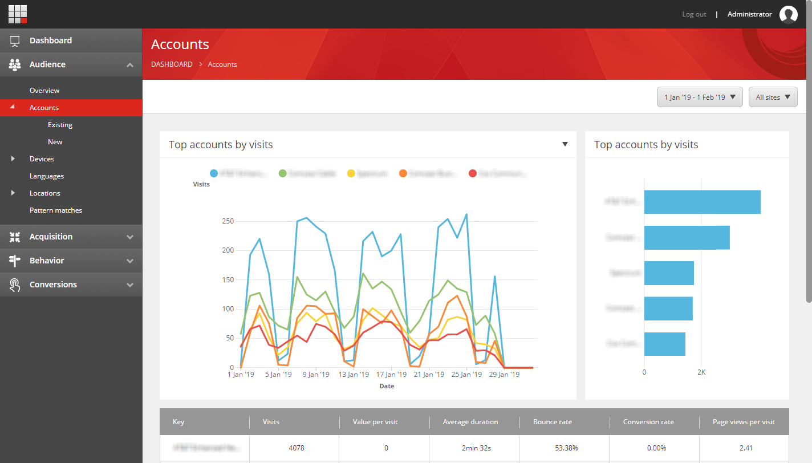
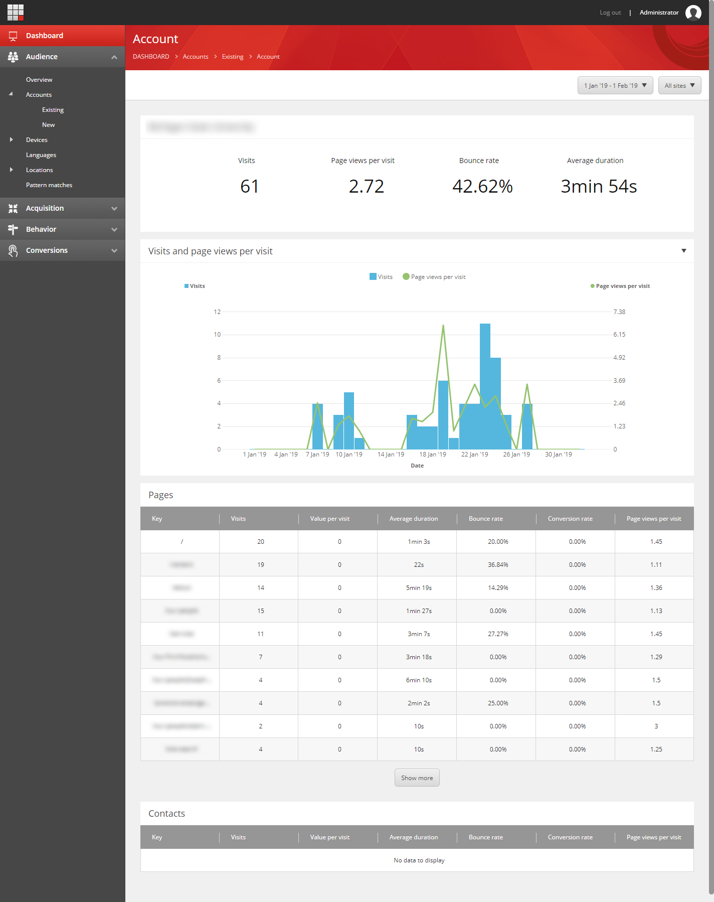
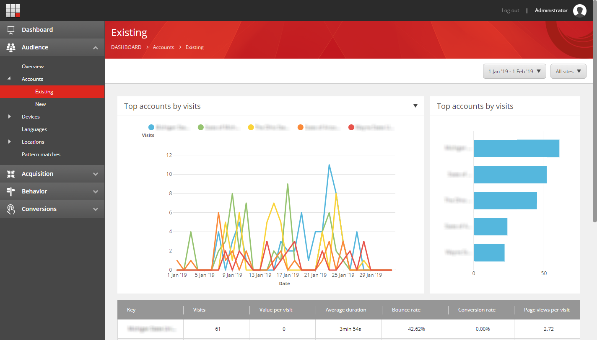
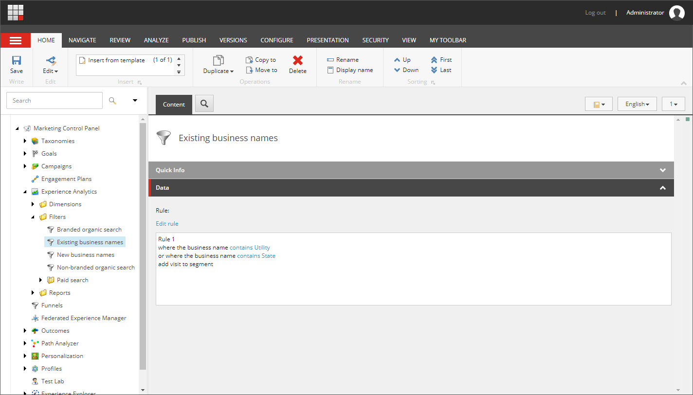
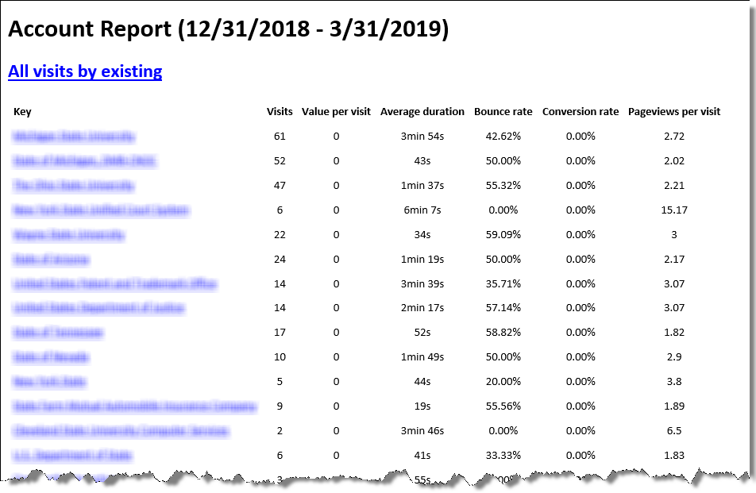
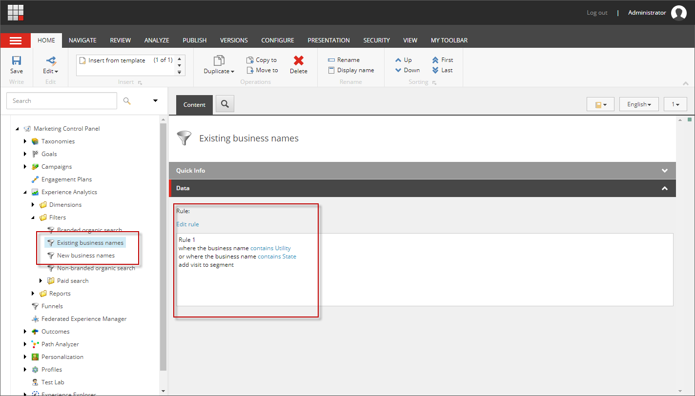
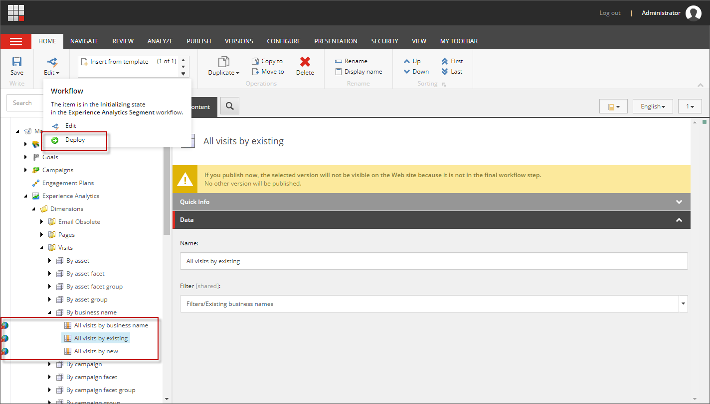
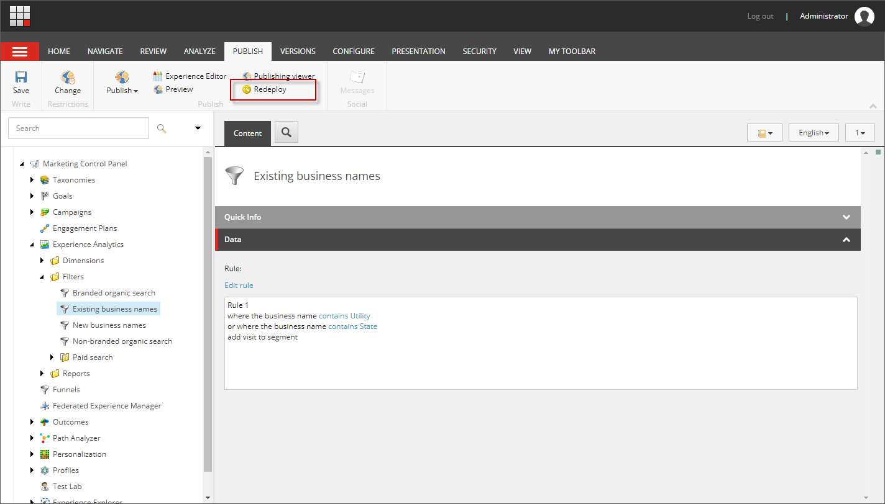
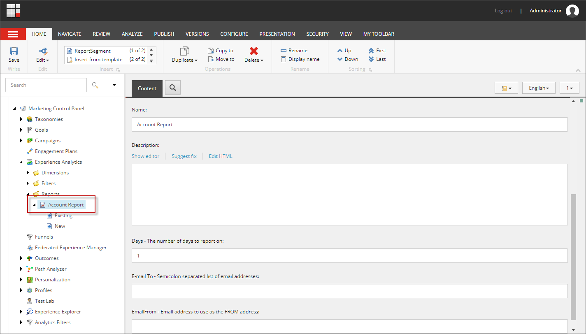
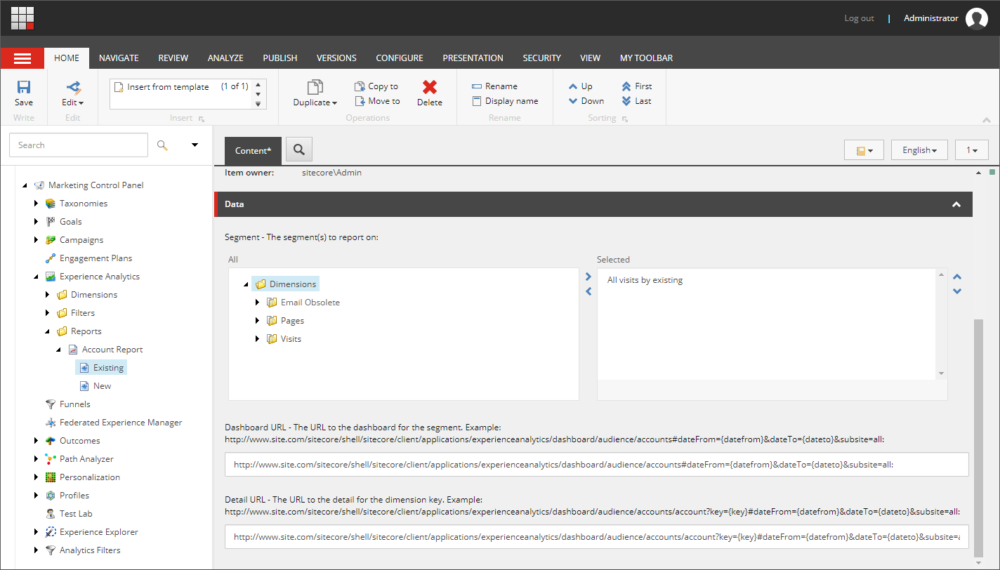

# Sitecore Account Reporting

The Sitecore Account Reporting module adds strategic or key account reporting to Sitecore. This is to help with [Account-based Marketing](https://en.wikipedia.org/wiki/Account-based_marketing).  Several reports are included in the module.

This module only supports Sitecore 8.2.  It was built on Sitecore 8.2 update 2.

## Reports

### Accounts

The first report is an Experience Analytics Accounts report. The accounts report lists accounts or business names that visited within the time frame selected.  Accounts are sorted by the number of page visits.  This report includes ALL accounts that visited the site.   



> Note on data quality: The configured Sitecore GeoIP provider identifies businesses associated with visits to the site.  This is basically the business information tied to the incoming IP address.  The quality of the data coming from the GeoIP provider drives the quality of the business information.  A lower quality GeoIP provider will generally identify the Internet Service Provider (ISP) associated with an IP address.  It will also identify very large organizations.  Better quality GeoIP providers will identify the business associated with the IP address.  They will also call out if a business is an ISP or not. The Accounts report is directly impacted by the quality of the results by the GeoIP provider.  In the example you see above, most of the identified accounts are internet service providers.  The internet service providers have the most traffic and therefore appear at the top.

### Account Detail

Clicking on an account in the bar chart or in the table above will take the user to a account detail report. The account detail report gives specifics on the account.  The number of visits, page views per visit, bounce rate, and average duration is displayed. A graph of visits and page views per visit are also displayed. At the bottom of the report, the specific pages visited are displayed.  They are ordered from the most viewed to the least. Identified contacts are also displayed.  The contacts with the most views/visits appaer at the top, followed by the least at the bottom.



Clicking an identified contact takes the user to the respective Experience Profile for further investigation.

### Existing and New Accounts

The Existing and New Accounts reports are the same as the accounts report, except they display a filtered subset of accounts.  They are meant to contain existing and new accounts respectively. The accounts displayed in these reports are from a known set of accounts. Because the accounts are from known lists, ISPs can be filtered out.



The filters are user configurable and are setup in the **Marketing Control Panel** under **Experience Analytics / Filters**.  In the filters you can setup rules that determine what business names are included in the reports.



### Email Report

Also included in the reports is an Email digest report.  The Email digest is an email sent out daily that includes the information from from the Existing and New accounts reports, but in email form.  The timeframe is configurable to include the last number of days.  The email digest report can also be configured to include other dimensions / segments.  The keys in the report link back to the respective detail pages in Sitecore Experience Analytics.  The Segment name links to the respective dashboard in Sitecore Experience Analytics.



# Installation and Configuration

## Installation

There are 3 ways to install the Account Reporting package.  The first is via .update package.  This approach allows installing directly into an environment. Using this approach, the files are not tracked in version control.  The second way is to install into Visual Studio via NuGet packages.  This allows adding the module to version control. The third way is to manually copy the code into your project so it can be customized.

### Via Update Package
Download the latest Account Reporting module `.update` package from GitHub: https://github.com/mskutta/sitecore-account-reporting/releases

Install the module using the Update Installation Wizard: ```/sitecore/admin/UpdateInstallationWizard.aspx```.

### Via NuGet
Install the following NuGet packages.  You will need to host these packages: https://docs.microsoft.com/en-us/nuget/hosting-packages/overview

* Install `Skutta.AccountReporting` into the `Website` project
* Install `Skutta.AccountReporting.TDS.Core` into the `TDS.Core` project
* Install `Skutta.AccountReporting.TDS.Master` into the `TDS.Master` project

### Via Code Copy
1. Clone or download the Account Reporting repository into a location where you can copy the project structure
1. Copy folder `Skutta.AccountReporting` into your projects `src` folder. It should be a sibling of the Website, TDS.Master and TDS.Core projects
1. Open your project in Visual Studio and add the "Skutta.AccountReporting" project to your solution, also add a reference to this project from the website solution.
1. You may need to update the target framework on the `Skutta.AccountReporting` project to match the `Website` project. If this is required you will also need to open up the NuGet package manager for the solution and sync up the package versions.
1. Copy the folder `\Skutta.AccountReporting.Web\sitecore\admin` into the `\Website\sitecore\admin` folder in your project 
1. Copy the folder `\Skutta.AccountReporting.Web\App_config\Include\zzzzz` into the `\Website\App_config\Include\zzzzz` folder in your project
1. Install the following NuGet packages:
    * Install `Skutta.AccountReporting.TDS.Core` into the `TDS.Core` project
    * Install `Skutta.AccountReporting.TDS.Master` into the `TDS.Master` project* 

## Configuration

> Note: xDB needs to be enabled for the reports to work.

### Fact Table Creation
We need to add the **Fact** tables that support the reports by account.  The following SQL must be run against the reporting database to create the required fact tables.

* ```/src/Skutta.AccountReporting/Aggregation/Pipelines/Fact_ContactsByAccount.sql```
* ```/src/Skutta.AccountReporting/Aggregation/Pipelines/Fact_PageViewsByAccount.sql```

These files can be obtained via the Git repository.

### Configure Existing and New Accounts

Before we start collecting Business information for reporting, we need to configured the filters used to define Existing and New Accounts.  Perform the following steps to configure Existig and New Accounts:

1. Open the ```Makreting Control Panel``` from the Sitecore Dashboard
1. Navigate to ```Experience Analytics/Filters/Existing business names```.
1. Edit the ```Rule``` adding the necessary conditions.
1. Save the item.
1. Repeat for ```New business names```



### Deploy Segments

Now that we have the rules / filters configured, we need to deploy the segments for business name.  The filters above are associated with the business name segments.  To deploy the segments, perform the following steps:

1. Open the ```Marketing Control Panel``` from the Sitecore Dashboard
1. Navigate to ```Experience Analytics/Dimensions/Visits/By business name/All visits by business name```.
1. In the Ribbon, on the Home tab, select Edit... Deploy 
1. Repeat for ```All visits by existing```
1. Repeat for ```All visits by new```



> Note: Once the segments are deployed, they will not need to be deployed again.  If the **Existing business names** or **New business names** Filter is edited in the future, please select ```Redeploy``` from the Filter's Ribbon's publish tab to deploy the updated filter. 

> You will need to wait 30 minutes until data starts to be processed once a segment is deployed.

> Only new visits will be tracked by the above updates.  Historical visits will not participate in the reports.  If historical data is required, the reporting database must be re-built.  Information on how to rebuild the reporting database is here: https://doc.sitecore.com/developers/82/sitecore-experience-platform/en/walkthrough--rebuilding-the-reporting-database.html.  It may be desired to disable the indexing of anonymous contacts as documented here: https://kb.sitecore.net/articles/171238

### Email Reports

#### Report Configuration

The email reports are managed in the Marketing Control Panel.  The reports appear under ```Marketing Control Panel / Experience Analytics / Reports```.

A report can be configured with the following information
* Name
* Description
* Days - The number of days to report on
* E-mail To - Semicolon separated list of email addresses
* Email From - Email address to use as the FROM address



The data included within the report are configured as child items.  Here you can choose the segment to report on.  If you would like links in the report, populate the ```Dashboard URL``` and/or ```Detail URL```.  These should be links to the respective segment dashboard and detail pages.

* The Dashboard URL is in the following format: ```http://www.site.com/sitecore/shell/sitecore/client/applications/experienceanalytics/dashboard/audience/accounts#dateFrom={datefrom}&dateTo={dateto}&subsite=all```.  Note the ```{datefrom}``` and ```{dateto}``` tokens.
* The Detail URL is in the following format: ```http://www.site.com/sitecore/shell/sitecore/client/applications/experienceanalytics/dashboard/audience/accounts/account?key={key}#dateFrom={datefrom}&dateTo={dateto}&subsite=all```.  Note the ```{key}```, ```{datefrom}``` and ```{dateto}``` tokens.



By default the email reports are in **SAFE MODE**.  This means that the reports will not be sent to the email addresses configured in the report. This prevents accidentally sending emails when in a development environment using a production database.  To disable safe mode, the following config setting must be added to the production environment:

```xml
<?xml version="1.0"?>
<configuration xmlns:patch="http://www.sitecore.net/xmlconfig/" xmlns:set="http://www.sitecore.net/xmlconfig/set/">
  <sitecore>
    <settings>
      <setting name="Skutta.AccountReporting.DisableSafeMode" set:value="true" />
    </settings>
  </sitecore>
</configuration>
```

> IMPORTANT: The above setting should only be set in the production environment.

To send emails in a development environment, please use the following config:

```xml
<?xml version="1.0"?>
<configuration xmlns:patch="http://www.sitecore.net/xmlconfig/" xmlns:set="http://www.sitecore.net/xmlconfig/set/">
  <sitecore>
    <settings>
      <setting name="Skutta.AccountReporting.SafeModeEmailTo" set:value="email@address.com" />
      <setting name="Skutta.AccountReporting.SafeModeEmailFrom" set:value="email@address.com" />
    </settings>
  </sitecore>
</configuration>
```
#### Report Testing

A test page has been provided to test the configured reports.  To test the reports:

1. Navigate to: ```/sitecore/admin/AccountReports.aspx```
1. Click the **Run All** button.

> Note: Email must be configured for the Email report to work.  Below is a sample email config:
 ```xml
<configuration xmlns:patch="http://www.sitecore.net/xmlconfig/" xmlns:set="http://www.sitecore.net/xmlconfig/set/">
  <sitecore>
    <settings>
      <setting name="MailServer" set:value="" />
      <setting name="MailServerUserName" set:value="" />
      <setting name="MailServerPassword" set:value="" />
      <setting name="MailServerPort" set:value="" />
    </settings>
  </sitecore>
</configuration>
```

#### Report Scheduling

Email reports need to be scheduled to run.  The implementation of scheduling has been left as an exercise for the reader.

The following method can be called from a scheduled task to trigger sending configured reports via email:

```c#
Skutta.AccountReporting.Reports.ReportRunner.Run();
```

An optional implementation of scheduling has also been provided.  This implementation can be configured to send once a day.  To enable this scheduler, remove the ```.disabled``` extension from ```Skutta.AccountReporting.ReportsTask.config.disabled```.  Alternatively, add the following configuration:

```xml
<?xml version="1.0"?>
<configuration xmlns:patch="http://www.sitecore.net/xmlconfig/" xmlns:set="http://www.sitecore.net/xmlconfig/set/">
  <sitecore>
    <scheduling>
      <agent type="Skutta.AccountReporting.Reports.Task,  Skutta.AccountReporting" method="Run" interval="00:15:00">
        <SyncDatabase>master</SyncDatabase>
        <RunTime>1:00am</RunTime>
      </agent>
    </scheduling>
  </sitecore>
</configuration>
```
Choose a time to run the report by setting the ```<RunTime>```


# Testing / Debugging

## Visit Spoofing
The Account Reporting module supports spoofing IP addresses and contact information. To enable spoofing, remove the ```.disabled``` extension from ```Skutta.AccountReporting.SpoofVisit.config.disabled```. Alternatively, add the following configuration:

```xml
<?xml version="1.0"?>
<configuration xmlns:patch="http://www.sitecore.net/xmlconfig/" xmlns:set="http://www.sitecore.net/xmlconfig/set/">
  <sitecore>
    <pipelines>
      <createVisit>
        <processor type="Skutta.AccountReporting.Pipelines.CreateVisit.SpoofVisit, Skutta.AccountReporting" patch:after="processor[@type='Sitecore.Analytics.Pipelines.CreateVisits.XForwardedFor, Sitecore.Analytics']" />
      </createVisit>
    </pipelines>
  </sitecore>
</configuration>
```

To spoof a visit, open a **new incognito window** in your favorite browser.  When creating the visit, ie, the first time the site is visited, you can add the following query string values:

* ```geoip={desired ip address}``` - This allows spoofing the IP address.  You can enter whatever IP address you would like and have the Visit / GeoIP provider use that IP address for the session.
* ```identifier={identity identifier}``` - If you want to create an identified contact as part of the visit, provide a string that represents the identity of the contact.  This results in the contact being identified.

Example: ```http://site.com/?geoip=38.140.55.234&identifier=mskutta```

# Appendix

## GeoIP providers

The GeoIP provider is the key to identifying businesses based on IP address.  The quality of the data provided by the GeoIP provider directly drives the quality of the reports.  By default, the Sitecore IP Geolocation Service is used to provide the data. Alternate GeoIP providers can be configured to work with Sitecore.

## Enable GeoIP Lookup

Sitecore IP Geolocation is included in the initial version of Sitecore Experience Platform 8.1 (Sitecore XP) and all later versions by default

* Sitecore 8.2: https://doc.sitecore.com/developers/82/sitecore-experience-platform/en/setting-up-sitecore-ip-geolocation.html
